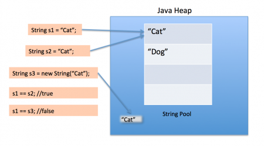

>-- 항상 결과(정답)을 먼저 얘기하고(길면 1분), 뒤에 늘여서 얘기할지 물어볼 것. 만약 안된다 하면 킵하고 면접 끝날때 쯤
"아까 ~~ 이거에 관해서 더 말씀드리고 싶은 게 있는데 괜찮을까요" 물어보고.. --

- 불변 객체란 무엇일까 ?
  - 객체 생성 이후 내부의 상태가 변하지 않는 것(객체)을 의미한다.
  Primitive Type인 경우 final 키워드를 사용해서 불변 객체를 만들 수 있으며, Reference Type일 경우엔 어떠한 추가적인 작업이 필요하다.
    - 그렇다면 Reference Type인 경우엔 어떤 작업이 필요한지?
      - 객체를 참조하거나, Array나 List 등을 참조할 수 있다.
      - Reference 변수가 일반 객체일 경우 객체를 사용하는 필드의 참조 변수도 불변 객체로 변경할 것
      - Array일 경우 Array를 받아 copy 해서 저장하고, getter를 clone으로 반환하면 된다.
      - List일 경우 Array와 마찬가지로 생성 시 새로운 List를 만들어 값을 복사하도록 해야한다.
    - 불변 객체, final를 사용하는 이유는 무엇인가?
      - 말 그대로 데이터가 변하지 않는 값을 원하기 때문이다. 조금 더 자세한 상황으로
      - Thread Safe해서 병렬 처리에 유용하며, 동기화를 고려하지 않아도 된다는 점
      - 어떤 예외처리가 되었다 한들, 데이터는 변경되지 않았기 때문에 이전으로 돌아갈 수 있다.(똑같이 처리 가능)
      - 에러를 피해 오류를 최소화할 수 있다. (Error Exception ?)

- Java의 메모리 공간을 설명해달라 
  - 메서드(static) 영역 - 전역변수, static 변수를 저장하고, 프로그램이 시작해 종료할 때까지 남아 있다.
  - 스택 영역 - 지역변수, 매개변수 데이터 값들이 저장된다. LIFO 구조로 되어 있으며,
  메서드가 호출될 때 메모리에 할당되며 종료하면 메모리가 해제된다.
  그리고 변수에 새로운 데이터가 할당된다면 이전 데이터는 삭제된다.
  - 힙 영역 - new 키워드로 인스턴스를 생성할 때 저장된다. GC에 의해서 필요없는 데이터들은 정리된다.
  - **Thread 들끼리 서로 힙 영역의 데이터들을 공유한다**.
    - 그렇다면 각 영역마다 할당되는 시점은 언제인가?
      - 메서드 영역은 JVM이 동작해서 클래스가 로딩될 때 생성된다.
      - 스택 영역은 컴파일 타임 시 할당된다.
      - 힙 영역은 런타임 시 할당된다.

- String new와 ""연산으로 생성했을 때의 차이점은 무엇인지?
  - new 생성과 ""연산(리터럴)의 차이점은 메모리 영역 내의 차이점이 있다.
  new 생성으로 인스턴스를 생성할 경우 힙 영역에 할당되어 저장된다. 리터럴로 생성했을 경우, 힙 영역 안에 있는
  String constant pool 영역에 저장된다. 
  추가적으로 이 리터럴로 생성된 데이터 값이 서로 같을 경우, Pool 안에 있는 데이터 값들을 서로 같은 곳에 바라보게 된다.
  `String s1 = "cat" 과 String s2 = "cat" 은 서로 같은 곳을 바라본다.`
   [Java String Constant Pool](https://www.digitalocean.com/community/tutorials/what-is-java-string-pool)