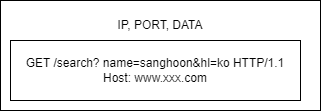

# Get & Post

우선 Get method와 Post method를 알아보기 전에, 짧게 **HTTP method에 관해 정리**하겠습니다.
그리고 **HTTP의 대략적인 흐름**을 잡고 본론으로 들어가보도록 하겠습니다.

### HTTP method

- **GET** : resource 조회
- **POST** : 요청 데이터를 처리하고 주로 등록한다는 개념입니다.
- PUT : resource를 대체합니다.(전체) 없다면 생성합니다.
- PATCH : resource의 부분 변경합니다.
- DELETE : resource를 삭제합니다.

---

- HEAD : GET method와 동일하지만 message 부분을 제외하고, 상태 줄과 header만 반환합니다.
- OPTIONS : 대상 resource에 대한 통신 가능 method를 설명합니다.
- CONNECT : 대상 resource로 식별되는 server에 대한 터널을 설정합니다.
- TRACE : 대상 resource에 대한 경로를 따라 message 루프백 test 수행합니다.


### HTTP 흐름

보통 우리가 웹 URL들을 확인해 보면 아래와 비슷한 형식들을 볼 수 있습니다.
```
https://www.xxx.com/search?......
```
www로 시작해 com으로 끝나는 지점까지(뒤에 PORT는 생략되어 있습니다.) **DNS**를 조회합니다.

```
**여기서 DNS 란?**

본래 모두 다 고유의 IP를 갖고 있습니다. 위의 웹 URL도 IP를 갖고 있을 겁니다. 200.200.200.2 ...(예시)

하지만 우리가 모든 웹들을 들어가려 할 때마다 이러한 복잡한 수들을 모두 외워서 들어가야 한다면 이용할 수 없을 것입니다.

쉽게 말해, **영문/한글 주소를 IP 네트워크에서 찾아갈 수 있는 IP로 변환해 줍니다.**

DNS에 관해서 설명하자면 너무나도 길어질 테니 짧게 마무리 하겠습니다.
```

웹 브라우저는 HTTP 요청 message를 생성합니다. HTTP 요청 메시지는 아래의 예시와 같이 생겼습니다.

```
GET /search?name=sanghoon&hl=ko HTTP/1.1
Host: www.xxx.com
```

웹 브라우저가 위와 같이 메시지를 생성하면 Socket 라이브러리를 통해 전달하게 됩니다.

그 후, TCP/IP 패킷을 생성해 이 요청 message를 감싸주어 패킷을 생성하게 됩니다.

이렇게 생성된 패킷은 아래와 같이 생겼습니다.



그래서 웹 브라우저에서 해당 server(www.xxx.com)으로 위의 패킷을 보내주면, server는 패킷을 확인 후

웹 브라우저에게 Response Message를 내려주게 되는 것입니다. 똑같이 패킷을 생성 후 요청에 맞는 응답값을 보내주지만 message 내용이 조금 다릅니다.

```
HTTP/1.1 200 OK
Content-Type : text/html;charset=UTF-8
Content-Length: ~...

<html>..
```

이렇게 Response Message까지 받고나면 웹 브라우저는 client에게 데이터를 뿌려주는 형식이 됩니다.

## Get

- resource를 조회합니다.
- data를 읽을 때 사용되고, 수정할 때는 사용되지 않습니다.
- data의 변형 위험 없이 사용할 수 있습니다.
- server에 전달하고 싶은 data는 query를 통해 전달하게 됩니다.
- message body를 사용해 data를 전달할 수는 있지만 지원하지 않는 곳이 많다 합니다.

Resource 조회를 할 때, client는 server에게 위의 HTTP 요청 메시지를 담아 server에 보냅니다.

예를 들어, 우리가 흔히 사용했던 RESTful API 방식에서 GetMapping("/user/1)이라면, DB 1번 사용자의 정보를 조회할 수 있습니다.

Response 응답값으로 server는 그에 맞는 데이터를 가공해 client에게 넘겨주게 됩니다. (위의 응답 message처럼 담아서요!)


## Post

- 요청 data를 처리합니다.
- Message Body를 통해서 server로 요청 data를 전달하게 됩니다.
- server는 요청 data를 처리하게 되는데, message body를 통해 들어온 data를 처리하는 기능을 수행하게 됩니다.
- 주로 전달된 data로 resource 등록 같은 것에 사용하게 됩니다.
- 그리고 chrome의 개발자 도구 같은 것으로 Post 요청 data를 확인할 수 있습니다. 따라서 보안적으로 조심해야합니다.

Get 방식과는 반대의 데이터로 client는 server에게 data를 묶어서 보내주게 됩니다.

예를 들어, PostMapping("/user")라면, 회원을 신규로 생성하게 됩니다.(예시입니다.)

```
Post / user HTTP/1.1
Content-Type : application/json

{
    "name" : "sanghoon"
    "age" : "27"
}
```

위와 같은 데이터를 전송하여 Server는 새로 resource를 생성하게 됩니다. (/user/2)

응답값으로 "/user/2"에 관한 데이터를 묶어서 client에게 다시 보내주게 됩니다.

아래는 Resource의 전달방식 차이를 표현했습니다. **출처**는 아래에 남기도록 하겠습니다.

|         | GET |  POST  |
|:-------:|:---:|:------:|
|   캐시    |  O  |X|
| 브라우저 기록 |  O  |X|
| 북마크 추가  |  O  |X|
|데이터 길이 제한 | O | X |
|HTTP 응답 코드 | 200(Ok) | 201(Created) |
|언제 주로 사용하는지 ? | Resource 요청 | Resource 생성 | 
| Resource 전달 방식은 ? | Query | HTTP Body | 
| idempotent | O | X | 

위의 idempotent란 짧게 말해 연산을 여러 번 적용해도 달라지지 않는 성질이란 뜻입니다.

- GET은 여러 번 시도해도 똑같이 값이 나와야 하며, 달라져선 안 됩니다.
- POST는 Non-idempotent하기 때문에 응답은 다를 수 있습니다.

[Resource 전달방식의 차이](https://velog.io/@songyouhyun/Get%EA%B3%BC-Post%EC%9D%98-%EC%B0%A8%EC%9D%B4%EB%A5%BC-%EC%95%84%EC%8B%9C%EB%82%98%EC%9A%94)

---

# 동기 & 비동기

동기와 비동기는 CS 뿐만 아니라 다른 곳에서도 꽤나 많이 사용되는 메커니즘입니다.

- 동기 : 동기는 작업이 실행되고 해당 작업이 완료될 때까지 기다립니다. 그 작업이 완료될 때까지 기다리면서 다른 작업을 수행하지 않습니다.
  작업이 완료가 되면 결과가 반환됩니다.
- 비동기 : 비동기는 작업이 실행되고 해당 작업이 완료될 떄까지 기다리지 않으며, 기다리는 동안 다른 작업을 수행할 수 있습니다.
  결과는 작업이 완료될 때 반환됩니다.

이의 매커니즘은 제가 현재 개인 프로젝트를 진행하면서 볼 수 있었던 키워드인데, 바로 채팅입니다.

채팅은 **순서대로(동기) 데이터가 보내져야 한다는 것입니다.** (물론 순서대로 나가던말던 상관 없을 때도 있긴 합니다만...)

여기서 성능적으로 생각해볼 수 있습니다. 동기는 작업이 완료될 때까지 해당 작업을 기다려야 합니다. 기다리게 되면 비동기보다 성능적으로는 속도 면에서 떨어질 수 있습니다.

하지만 **순서는 보장된다는 점이 큰 장점**이고, 비동기는 반대로 동기보다 성능적으로 속도에서는 더 빠르지만 순서는 보장되지 않습니다.

이는 채팅 뿐만 아니라 멀티 Thread나 이벤트 기반 프로그래밍에서 중요한 키워드입니다.

**요약하자면**, 동기는 작업이 순차적으로 실행되고 완료될 때까지 기다리는 방식이며, 비동기는 작업이 병렬적으로 실행되고 완료될 때까지 다른 작업을 수행하는 방식입니다.


해당 주제와 내용은 다르지만, 추가적으로 동기와 비동기 그리고 블로킹과 논블로킹에 대해 비교해보며 알아보는 것도 좋을 것 같습니다.

아래는 그에 관해 간단하게 설명되어 있는 출처입니다.

[동기와 비동기 그리고 블로킹과 논블로킹](https://velog.io/@nittre/%EB%B8%94%EB%A1%9C%ED%82%B9-Vs.-%EB%85%BC%EB%B8%94%EB%A1%9C%ED%82%B9-%EB%8F%99%EA%B8%B0-Vs.-%EB%B9%84%EB%8F%99%EA%B8%B0)

[동기 비동기 차이](https://sh-safer.tistory.com/339)